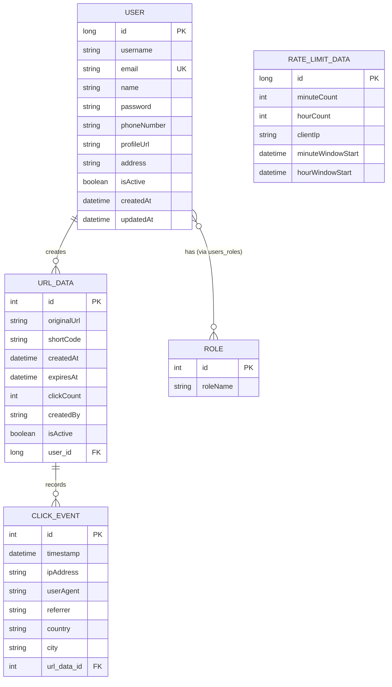

# 🔗 TinyLink — URL Shortener

A scalable URL shortener backend built with **Spring Boot**. It generates short links, redirects visitors, tracks click analytics, rate-limits abusive clients, and leans on Redis to keep the hot path fast.

No frontend here — this is a pure REST API, meant to be driven through Swagger, Postman, or your own client.

---

## ✨ What it does

Give it a long URL, get back something short. Under the hood, three things make it more than a toy project:

- **Speed** — redirects are served from a Redis cache, not the database, so the hot path stays fast even under load.
- **Self-defense** — IP-based rate limiting sits in front of URL creation, backed by Redis so it works correctly across multiple app instances, not just in one JVM's memory.
- **Self-cleaning** — a scheduled job quietly retires expired links and their cache entries in the background, so nothing has to be cleaned up by hand.

### Highlights

| | |
|---|---|
| 🔤 **Short codes** | Base62-generated, or bring your own custom alias |
| ⏰ **Expiration** | Set an expiry date; cleanup handles the rest automatically |
| ⚡ **Caching** | Redis-backed `shortCode → originalUrl` lookups for fast redirects |
| 🛡️ **Rate limiting** | Per-IP limits on link creation, distributed via Redis |
| 📊 **Analytics** | Click counts, IP/user-agent metadata, geo tracking, recent-click history |
| 🔐 **Auth** | JWT-based authentication with role-based access control |
| 📘 **Docs** | Full OpenAPI/Swagger spec, browsable and testable in-browser |

---

## 🛠️ Tech Stack

| Layer | Technology |
|---|---|
| **Language / Framework** | Java 21, Spring Boot, Spring Security, Spring Data JPA, Hibernate, Lombok |
| **Database** | MySQL |
| **Caching & Rate Limiting** | Redis |
| **Auth** | JWT |
| **File Storage** | AWS S3 |
| **Docs** | Swagger / OpenAPI |
| **Deployment** | Docker, Docker Compose |

---

## 🚀 Running It

```bash
git clone https://github.com/<your-username>/tinylink.git
cd tinylink

# spin up MySQL + Redis
docker-compose up -d

# run the app
mvn spring-boot:run
```

| | |
|---|---|
| API | `http://localhost:8080` |
| Swagger UI | `http://localhost:8080/swagger-ui/index.html` |

**Requirements:** Java 21 · Maven · Docker & Docker Compose · MySQL

---

## 🔄 How a Link's Life Looks

**Creating one**
1. Client sends `POST /api/shorten`
2. The rate limiter checks the caller's IP before anything else happens
3. A custom alias is used if provided, otherwise a random Base62 code is generated
4. The link is persisted, then cached in Redis (`shortCode → originalUrl`)
5. The response comes back with the short URL, code, original URL, and timestamps

**Visiting one**
1. A client hits `GET /api/{shortCode}`
2. Redis is checked first — cache hit means an instant `302` redirect
3. On a cache miss, the database is checked instead
4. An expired link is marked inactive and returns `404`
5. Otherwise, the click is recorded and the visitor is redirected

**Checking on one**
- `GET /api/stats/{shortCode}` returns click count, status, and timestamps
- `GET /api/analytics/{shortCode}` goes deeper — geo data, request metadata, click history

**In the background**
- A scheduled cleanup job periodically sweeps expired links, marks them inactive, and evicts their Redis cache entries — no manual housekeeping required.

---

## ⚡ Why Redis, twice

Redis pulls double duty here, and it's worth knowing the two roles aren't related:

**1. As a cache** — `url:{shortCode} → originalUrl`, with a TTL. This is the classic cache-aside pattern: check Redis first, fall back to the database, then repopulate the cache. It exists purely for speed.

**2. As shared rate-limit state** — `rate-limiter:{clientIp} → RateLimitData`, expiring after an hour. Since the app can run as multiple instances, rate-limit counters can't just live in local JVM memory — that would let each instance grant its own separate quota. Redis gives every instance the same view of who's over their limit.

> 💡 Don't confuse `requestCount` (rate-limit counter) with `clickCount` (analytics counter) — they live in different systems and track completely different things.

---

## 🗄️ Data Model

Five entities, four with an obvious job and one that stands apart:

- **`User`** — account holder. Owns links, holds roles.
- **`Role`** — a name (`USER`, `ADMIN`, ...), joined to users through `users_roles`.
- **`UrlData`** — the short link itself: code, target, expiry, click count.
- **`ClickEvent`** — one row per visit to a link: who, when, where from.
- **`RateLimitData`** — per-IP request counters. Deliberately *not* tied to a user — it's keyed by `clientIp`, so it can throttle anonymous callers too, not just logged-in ones.



**Why it's shaped this way:**

- `User → UrlData` is one-to-many with `CascadeType.ALL` — deleting a user deletes their links. Deliberate, but worth knowing: there's no soft-delete cascade, so it's permanent.
- `UrlData → ClickEvent` is the same pattern — one link, many recorded visits, cascaded on delete.
- `User ↔ Role` is many-to-many, `EAGER`-fetched. Fine at small scale, but every time a `User` loads, its roles load with it — if the roles table grows or this entity gets queried a lot, that's a candidate to switch to `LAZY` later.
- `RateLimitData` has **no foreign key to `User`** — and that's correct, not an oversight. Rate limiting has to work before you know who's calling (unauthenticated requests, registration spam, etc.), so it can only key off `clientIp`.

**Worth considering:**
- `shortCode` and `clientIp` are both hot lookup columns but neither shows an explicit index/unique constraint here — both are good candidates for one, especially `shortCode` since every redirect depends on finding it fast.
- `UrlData.createdBy` (String) duplicates information already available via `UrlData.user` — picking one as the source of truth would avoid the two silently drifting apart.

---

## 📡 API Reference — URL Shortener

All endpoints are prefixed with `/api`. Interactive docs live at `/swagger-ui/index.html`.

### `POST /api/shorten`
Create a new short URL. Subject to rate limiting on the caller's IP.

**Body**
```json
{
  "originalUrl": "https://example.com/some/very/long/path",
  "customAlias": "my-alias",
  "expiresAt": "2026-07-18T14:00:00.000Z"
}
```

**Response `200 OK`**
```json
{
  "statusCode": 200,
  "message": "URL shortened successfully",
  "data": {
    "shortUrl": "http://localhost:8080/api/abc123",
    "shortCode": "abc123",
    "originalUrl": "https://example.com/some/very/long/path",
    "createdAt": "2026-07-18T14:00:00.000Z",
    "expiresAt": "2026-07-18T15:00:00.000Z"
  }
}
```

---

### `GET /api/stats/{shortCode}`
Get stats for a single short link.

**Response `200 OK`**
```json
{
  "statusCode": 200,
  "message": "Stats fetched successfully",
  "data": {
    "shortCode": "abc123",
    "originalUrl": "https://example.com/some/very/long/path",
    "clickCount": 42,
    "createdAt": "2026-07-18T14:00:00.000Z",
    "expiresAt": "2026-07-18T15:00:00.000Z",
    "active": true
  }
}
```

---

### `GET /api/analytics/{shortCode}`
Deep analytics for a link — click history, geo data, request metadata.

**Response `200 OK`**
```json
{
  "statusCode": 200,
  "message": "Analytics fetched successfully",
  "data": { }
}
```

---

### `GET /api/my-all`
All short URLs created by the authenticated user.

**Response `200 OK`**
```json
{
  "statusCode": 200,
  "message": "URLs fetched successfully",
  "data": [
    {
      "shortUrl": "http://localhost:8080/api/abc123",
      "shortCode": "abc123",
      "originalUrl": "https://example.com/some/very/long/path",
      "createdAt": "2026-07-18T14:00:00.000Z",
      "expiresAt": "2026-07-18T15:00:00.000Z"
    }
  ]
}
```

---

### `GET /api/safe/{shortCode}`
Checks whether a short link is still valid/active — a lightweight guard before redirecting.

**Response:** `200 OK`

---

### `GET /api/{shortCode}`
The actual redirect. Resolves the short code and sends the visitor on to the original URL.

**Response:** `302 Found` → `Location: <originalUrl>`, or `404` if expired/unknown.

---

## 📦 Response Shape

Most JSON responses share the same envelope:

```json
{
  "statusCode": 200,
  "message": "Human-readable message",
  "data": { }
}
```

---

## 📄 License

MIT — or swap in whatever you're actually using.
